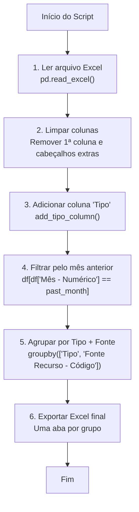

# Geração de dados de pagamento em ordem cronológica

O script python descrito abaixo, de forma geral, realiza a geração de dados de pagamento, a partir de de consulta global do B.O (SAP) realizada previamente. 

O script filtra essa consulta global, gerando dados para o mês anterior do qual o código está sendo executado. Esses dados são então agrupados em tipo de serviço e código da fonte de recurso. 

Para acessar o repositório do github, [clique aqui](https://github.com/SPF-SEPLAG/filter-dataset). 

Abaixo segue o detalhamento do script citado.

## Explicação do script (passo a passo)

Este script carrega um arquivo Excel, adiciona uma coluna calculada chamada **"Tipo"**, filtra os dados pelo mês anterior e, por fim, **divide os resultados em várias abas** dentro de um novo arquivo Excel — agrupando por **Tipo** e **Fonte Recurso - Código**.

## Passo a Passo da Lógica

### Fluxo geral


### 1. Importações necessárias
```python
import pandas as pd
import warnings
from datetime import datetime
from filter_data_utils import add_tipo_column
```
- pandas → manipulação do Excel.
- warnings → usado para esconder warnings do openpyxl.
- datetime → pega o mês anterior.
- add_tipo_column → função customizada para preencher a coluna Tipo.

### 2. Ignorando warnings irrelevantes
```python
warnings.filterwarnings("ignore", category=UserWarning, module="openpyxl")
```
Esconde mensagens de alerta (warnings) do openpyxl para não poluir o terminal.

### 3. Carregando o Excel
```python
file_path = "./data/dataset.xlsx"
df = pd.read_excel(file_path, sheet_name="Relatório 1", skiprows=3)
df = df.iloc[:, 1:]
```
- `file_path` → define o caminho do diretório do arquivo.
- `skiprows=3` → pula as 3 primeiras linhas (cabecalhos extras).
- `df.iloc[:, 1:]` → remove a primeira coluna (vazia ou inútil).

### 4. Criando a coluna "Tipo"
```python
df = add_tipo_column(df)
```
A função `add_tipo_column()`:
- olha para `"Elemento Item Despesa - Código"`
- associa o nome correspondente ao código, criando nova coluna `"Tipo"` (ex: 3001 → "Fornecimento")
- retorna o dataframe com a nova coluna

### 5. Filtrando pelo mês anterior
```python
past_month = datetime.now().month - 1
df_filtered = df[df["Mês - Numérico"] == past_month]
```
- descobre o mês anterior,
- pega apenas as linhas cujo `"Mês - Numérico"` coincide.

### 6. Agrupando resultados
```python
groups = df_filtered.groupby(["Tipo", "Fonte Recurso - Código"])
```
- Aqui você divide os dados como se fossem “categorias”, por exemplo:

| Tipo         | Fonte Recurso - Código |
| ------------ | ---------------------- |
| Fornecimento | 100                    |
| Fornecimento | 200                    |
| Serviço      | 100                    |

- Cada combinação vira uma aba diferente no Excel final.

### 7. Gerando o arquivo final
```python
output_path = f"./data/output_{past_month}.xlsx"
with pd.ExcelWriter(output_path, engine="openpyxl") as writer:
    for k, ((tipo, fonte), group_df) in enumerate(groups):
        sheet_name = f"{tipo} - Fonte {fonte}"
        group_df.to_excel(writer, sheet_name=sheet_name, index=False)
```
Para cada grupo:
- cria uma aba com nome `"Tipo - Fonte XYZ"`.
- exporta somente as linhas daquele grupo.
O resultado final é uma pasta de trabalho Excel contendo várias abas separadas por Tipo + Fonte.

