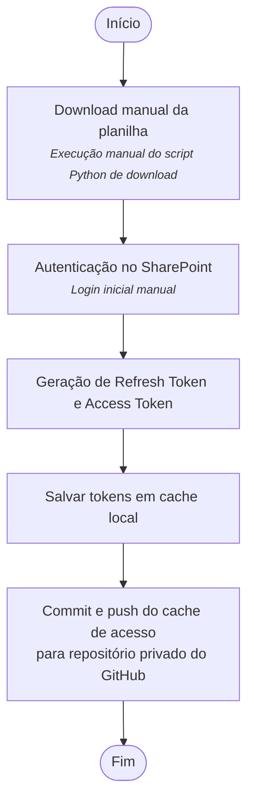

# Download da planilha do Sharepoint

- Abaixo segue o detalhamento do script de download da planilha e do script de geração dos Tokens necessários para o credenciamento no Sharepoint.

# Fluxo geral
Para que o processamento e a atualização dos dados ocorram em tempo real, foi necessário primeiro garantir que o **download da planilha** fosse executado de forma automática. Assim, quando o script de tratamento fosse iniciado, ele utilizaria sempre os dados mais recentes disponíveis.

Para criação dessa rotina foi utilizada bibliotecas da Microsoft, em conjunto com **scripts e credenciais fornecidos pelos técnicos da Subsecretaria Central de Planejamento e Orçamento (SPLOR/SEPLAG)**, permitindo o download da planilha e execução dos scripts de tratamento de forma automatizadaq.

No entanto, a execução dessa rotina de forma totalmente automatizada em Python apresentava uma grande limitação inicialmente: o login no SharePoint exigia autenticação manual a cada execução, o que inviabilizava a automação completa do download.

Para contornar essa restrição, foi criado **fluxo de autenticação seguro**, a partir da  implementação de uma **lógica para geração automática** de **Access Token** a partir de um **Refresh Token**, obtido após um login manual inicial. O cache de acesso é então versionado via **commit e push no repositório GitHub**, garantindo que a autenticação seja reutilizada nas execuções seguintes.

> Para entender o que são Access Token e Refresh Token, [clique aqui](./../guides/github/access_refresh_tokens.md).

Por questões de segurança, o repositório GitHub foi configurado como **privado**.

Nos próximos tópicos, serão explicados em detalhes o **fluxo de autenticação** e os **scripts responsáveis pelo download automatizado**.

## Primeira execução do script de download (execução manual)
- A primeira execução deverá ser realizada de forma manual para geração do **Access Token** e do **Refresh Token** salvos no arquivo **cache**. 
- O arquivo cache então deverá commitado para o repo do Github.

## Execuções automatizadas
- A partir do arquivo cache commitado para o github torna-se possível a execução automática do script de download por conta da lógica de geração de Access Token a partir de Refresh Token.  

 autenticação automática das VMs do por conta da lógica de geração de Access Token a partir de Refresh Token.

