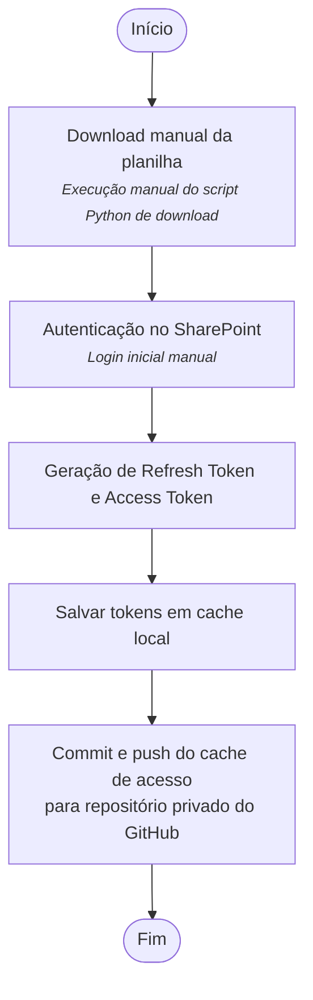

# Download da planilha do Sharepoint e geração dos Tokens
Para que a rotina funcione automaticamente via GitHub Actions, é necessário **gerar o Access Token e o Refresh Token uma única vez**, manualmente. Esses tokens ficam salvos em um arquivo de cache e serão reutilizados nas execuções seguintes.

As próximas execuções serão automáticas e silenciosas, sem necessidade de login manual.

## 1. Visão Geral do Processo
- Na **primeira execução**, o usuário realiza login interativo no navegador.
- O script salva os tokens no arquivo `msal_cache.bin`.
- Nas execuções seguintes, o script utiliza o **Refresh Token** para obter o Access Token silenciosamente.
- O token obtido permite requisitar a API do SharePoint e realizar o download da planilha.

## 2. Arquivo principal: `download.py`

```python
from sharepoint_utils import download_sharepoint_file, get_sharepoint_token

base_url = "https://cecad365.sharepoint.com/sites/DPO"
folder_path = "/sites/DPO/Documentos Compartilhados/1 Orçamento/1 Acompanhamento da Execução Orçamentária/Execução 2025"

download_sharepoint_file(base_url, folder_path, "Execução Orçamentária 2025.xlsx", "Execução Orçamentária 2025.xlsx")
```

## 3. Função de Download 
```python
def download_sharepoint_file(base_url, folder_path, file_name, local_filename):
    """
    Downloads a file from SharePoint using dynamic components for the URL.
    """
```

**Parâmetros:**
- `base_url` — URL base do site SharePoint.
- `folder_path` — caminho interno da pasta onde o arquivo está.
- `file_name` — nome do arquivo no SharePoint.
- `local_filename` — nome com que será salvo localmente.

- Antes do download, a função chama `get_sharepoint_token()`, responsável por obter o Access Token.

## 4. Configurações de Autenticação

```python
config = {
  "authority": "https://login.microsoftonline.com/e5d3ae7c-9b38-48de-a087-f6734a287574",
  "client_id": "d44a05d5-c6a5-4bbb-82d2-443123722380",
  "scope": ["https://cecad365.sharepoint.com/.default"], #["Group.ReadWrite.All"],
  "username": "username@ca.mg.gov.br",
  "endpoint": "https://login.microsoftonline.com/common/oauth2/v2.0/authorize"
}
```
- Somente o campo `username` deve ser alterado
- Trocar: `username@ca.mg.gov.br` → por um login CA válido do responsável pela rotina.

# 5. Geração dos Tokens: get_sharepoint_token()
## 5.1. Carregamento do Cache
```python
def get_sharepoint_token():
    # ✅ Load or create token cache
    cache = msal.SerializableTokenCache()
    if os.path.exists(CACHE_FILE):
        cache.deserialize(open(CACHE_FILE, "r").read())
```
- Se existir um cache, ele contém o Access Token e o Refresh Token.
- Na primeira execução, o cache estará vazio.

## 5.2. Inicialização do aplicativo MSAL
```python
    app = msal.PublicClientApplication(
        config["client_id"], authority=config["authority"], token_cache=cache
        )
```
O aplicativo é carregado com:
- credenciais da organização,
- tokens existentes no cache (se houver).

*****PAREI AQUI 5.3.*******
- O app é então carregado com, além das credenciais da organização, as informações presentes no cache, se existirem.

```python
    # initialize result variable to hole the token response
    result = None 
```
- A variável `result` armazenará a resposta da aquisição do Access Token, silenciosamente ou iterativamente (detalhado abaixo).

```python
    # We now check the cache to see
    # whether we already have some accounts that the end user already used to sign in before.
    accounts = app.get_accounts(username=config.get("username"))
    print(accounts)
```
- A próxima etapa é checar se a credencial do usuário corresponde a algum dos usuários listados no cache. Ou seja, se o usuário, conforme inserido na variável username é autenticado e possui algum Token correspondente. Caso seja, a variável account será carregada com os dados desse usuário e caso não, ela será vazia. **É válido ressaltar que na primeira execução do script, essa variável accounts será vazia.**

```python
    if accounts:
        result = app.acquire_token_silent(config["scope"], account=accounts[0])
```
- Caso seja encontrado os dados daquele usuário no cache, o usuário é autenticado, ou seja, o Access Token é adquirido **silenciosamente** a partir do Refresh Token. 
- É essa aquisição **silenciosa** do Access Token que permite as execuções automatizadas da rotina pelo Github Actions.

```python
    if not result:
        # So no suitable token exists in cache. Let's get a new one from Azure AD.
        result = app.acquire_token_interactive(scopes=config["scope"])
```
- Em caso de ainda não haver tokens nem cache gerados, ou seja, **em se tratando de primeira execução**, os Tokens deverão ser gerado manualmente.
- A função `acquire_token_interactive()` abre o navegador e pede para o usuário logar na sua conta organizacional e, assim, se credenciar interativamente, gerando um novo Access Token e Refresh Token.

```python
    # ✅ Save updated cache
    if cache.has_state_changed:
        with open(CACHE_FILE, "w") as f:
            f.write(cache.serialize())
        print("💾 Token cache saved.")
```
- O cache de acesso, junto dos novos Tokens quando gerados são então salvos no arquivo `msal_cache.bin` (**se ele não existia previamente na pasta do projeto ele é criado aqui**). 

- De um jeito ou de outro será gerado o Access Token (ou interativamente ou silenciosamente, via Refresh Token), que é o que permite a conexão com a `API` do **Sharepoint**. 
- Como dito previamente, a variável `result` armazenará a resposta da aquisição desse Token. Quando a aquisição ocorrer corretamente, a função `get_sharepoint_token()` irá retornar essa variável, que será utilizada em sequência pela função `download_sharepoint_file()` para realizar o download da planilha que será tratada.

**Comentários**
- A função originalmente utilizada pela equipe da Assessoria da Inteligência de Dados da SPLOR para a geração dos Tokens não estava funcionando corretamente e teve que ser redesenhada. A função acima foi a versão final desenvolvida pela equipe de automação de processos da SPF.   
- Não será detalhado aqui o resto da funcionalidade da função de download, por motivos de não se achar necessário fazê-lo para o restante da compreensão do fluxo e por conta da complexidade do processo estar concentrado na maior parte na geração dos Tokens. 
- Para maior detalhamento da função de download, consultar o script original.


# Download da planilha do Sharepoint e geração dos Tokens
Como citado anteriormente, a primeira execução do script deverá ser feita de forma manual, para geração do Access e Refresh Tokens, salvos no arquivo de cache.

As execuções seguintes são feitas de forma automatizada pelo Github Actions. 

**download.py** 
```python
from sharepoint_utils import download_sharepoint_file, get_sharepoint_token

base_url = "https://cecad365.sharepoint.com/sites/DPO"
folder_path = "/sites/DPO/Documentos Compartilhados/1 Orçamento/1 Acompanhamento da Execução Orçamentária/Execução 2025"

download_sharepoint_file(base_url, folder_path, "Execução Orçamentária 2025.xlsx", "Execução Orçamentária 2025.xlsx")
```

**sharepoint_utils.py**
```python
def download_sharepoint_file(base_url, folder_path, file_name, local_filename):
    """
    Downloads a file from SharePoint using dynamic components for the URL.

    Args:
        base_url (str): The base SharePoint site URL (e.g., 'https://cecad365.sharepoint.com/sites/Splor').
        folder_path (str): The relative path to the folder containing the file (e.g., '/Documentos Compartilhados/General').
        file_name (str): The name of the file to download (e.g., 'datamart.xlsx').
        local_filename (str): The local path where the file will be saved.

    Returns:
        bool: True if the file was downloaded successfully, False otherwise.
    """
```

- Como parâmetros da função são chamados a URL do site da organização no Sharepoint e o caminho da pasta em que o arquivo está salvo. Em seguida, de acordo com as anotações da função, são passados o nome do arquivo que será baixado e o caminho local em que o arquivo será baixado.

- Na execução da função de download, primeiro é chamada a função de geração dos Tokens. É a função `get_sharepoint_token()`.
- Essa função utiliza a variável `config`, que contém os dados necessários para validar o acesso e realizar o credenciamento para utilização da `API` do **Office 365**.

**sharepoint_utils.py**
```python
config = {
  "authority": "https://login.microsoftonline.com/e5d3ae7c-9b38-48de-a087-f6734a287574",
  "client_id": "d44a05d5-c6a5-4bbb-82d2-443123722380",
  "scope": ["https://cecad365.sharepoint.com/.default"], #["Group.ReadWrite.All"],
  "username": "username@ca.mg.gov.br",
  "endpoint": "https://login.microsoftonline.com/common/oauth2/v2.0/authorize"
}
```
- A única informação que deverá ser alterada aqui é a vinculada à chave de username, com os dados da conta organizacional do usuário responsável pela execução da rotina . 
> Mudar `username@ca.mg.gov.br` para login ca válido. 

**sharepoint_utils.py**
```python
def get_sharepoint_token():
    # ✅ Load or create token cache
    cache = msal.SerializableTokenCache()
    if os.path.exists(CACHE_FILE):
        cache.deserialize(open(CACHE_FILE, "r").read())
```
- Inicialmente tenta-se ler o arquivo cache em que estarão armazenadas as informações de acesso do usuário e os Tokens de credenciamento, o Access Token e o Refresh Token. Caso esse arquivo exista, ele é lido e armazenado na variável cache.

```python
    app = msal.PublicClientApplication(
        config["client_id"], authority=config["authority"], token_cache=cache
        )
```
- O app é então carregado com, além das credenciais da organização, as informações presentes no cache, se existirem.

```python
    # initialize result variable to hole the token response
    result = None 
```
- A variável `result` armazenará a resposta da aquisição do Access Token, silenciosamente ou iterativamente (detalhado abaixo).

```python
    # We now check the cache to see
    # whether we already have some accounts that the end user already used to sign in before.
    accounts = app.get_accounts(username=config.get("username"))
    print(accounts)
```
- A próxima etapa é checar se a credencial do usuário corresponde a algum dos usuários listados no cache. Ou seja, se o usuário, conforme inserido na variável username é autenticado e possui algum Token correspondente. Caso seja, a variável account será carregada com os dados desse usuário e caso não, ela será vazia. **É válido ressaltar que na primeira execução do script, essa variável accounts será vazia.**

```python
    if accounts:
        result = app.acquire_token_silent(config["scope"], account=accounts[0])
```
- Caso seja encontrado os dados daquele usuário no cache, o usuário é autenticado, ou seja, o Access Token é adquirido **silenciosamente** a partir do Refresh Token. 
- É essa aquisição **silenciosa** do Access Token que permite as execuções automatizadas da rotina pelo Github Actions.

```python
    if not result:
        # So no suitable token exists in cache. Let's get a new one from Azure AD.
        result = app.acquire_token_interactive(scopes=config["scope"])
```
- Em caso de ainda não haver tokens nem cache gerados, ou seja, **em se tratando de primeira execução**, os Tokens deverão ser gerado manualmente.
- A função `acquire_token_interactive()` abre o navegador e pede para o usuário logar na sua conta organizacional e, assim, se credenciar interativamente, gerando um novo Access Token e Refresh Token.

```python
    # ✅ Save updated cache
    if cache.has_state_changed:
        with open(CACHE_FILE, "w") as f:
            f.write(cache.serialize())
        print("💾 Token cache saved.")
```
- O cache de acesso, junto dos novos Tokens quando gerados são então salvos no arquivo `msal_cache.bin` (**se ele não existia previamente na pasta do projeto ele é criado aqui**). 

- De um jeito ou de outro será gerado o Access Token (ou interativamente ou silenciosamente, via Refresh Token), que é o que permite a conexão com a `API` do **Sharepoint**. 
- Como dito previamente, a variável `result` armazenará a resposta da aquisição desse Token. Quando a aquisição ocorrer corretamente, a função `get_sharepoint_token()` irá retornar essa variável, que será utilizada em sequência pela função `download_sharepoint_file()` para realizar o download da planilha que será tratada.

**Comentários**
- A função originalmente utilizada pela equipe da Assessoria da Inteligência de Dados da SPLOR para a geração dos Tokens não estava funcionando corretamente e teve que ser redesenhada. A função acima foi a versão final desenvolvida pela equipe de automação de processos da SPF.   
- Não será detalhado aqui o resto da funcionalidade da função de download, por motivos de não se achar necessário fazê-lo para o restante da compreensão do fluxo e por conta da complexidade do processo estar concentrado na maior parte na geração dos Tokens. 
- Para maior detalhamento da função de download, consultar o script original.


**************PAREI AQUI
Se não conseguir gerar o Token silenciosamente, o navegador é aberto e pede-se ao usuário para logar na sua conta e, assim, se credenciar interativamente, gerando um novo Access Token e Refresh Token.

    if not result:
        # So no suitable token exists in cache. Let's get a new one from Azure AD.
        result = app.acquire_token_interactive(scopes=config["scope"])

    # ✅ Save updated cache
    if cache.has_state_changed:
        with open(CACHE_FILE, "w") as f:
            f.write(cache.serialize())
        print("💾 Token cache saved.")
    
    if "access_token" in result:
        #print(result)  # Yay!
        return result
    else:
        print(result.get("error"))
        print(result.get("error_description"))
        print(result.get("correlation_id"))  # You may need this when reporting a bug
```


- Abaixo segue o detalhamento do script de download da planilha e do script de geração dos Tokens necessários para o credenciamento no Sharepoint.


# Fluxo geral
Para que o processamento e a atualização dos dados ocorram em tempo real, foi necessário primeiro garantir que o **download da planilha** fosse executado de forma automática. Assim, quando o script de tratamento fosse iniciado, ele utilizaria sempre os dados mais recentes disponíveis.

Para criação dessa rotina foi utilizada bibliotecas da Microsoft, em conjunto com **scripts e credenciais fornecidos pelos técnicos da Subsecretaria Central de Planejamento e Orçamento (SPLOR/SEPLAG)**, permitindo o download da planilha e execução dos scripts de tratamento de forma automatizadaq.

No entanto, a execução dessa rotina de forma totalmente automatizada em Python apresentava uma grande limitação inicialmente: o login no SharePoint exigia autenticação manual a cada execução, o que inviabilizava a automação completa do download.

Para contornar essa restrição, foi criado **fluxo de autenticação seguro**, a partir da  implementação de uma **lógica para geração automática** de **Access Token** a partir de um **Refresh Token**, obtido após um login manual inicial. O cache de acesso é então versionado via **commit e push no repositório GitHub**, garantindo que a autenticação seja reutilizada nas execuções seguintes.

> Para entender o que são Access Token e Refresh Token, [clique aqui](./../guides/github/access_refresh_tokens.md).

Por questões de segurança, o repositório GitHub foi configurado como **privado**.


Nos próximos tópicos, serão explicados em detalhes o **fluxo de autenticação** e os **scripts responsáveis pelo download automatizado**.


## Primeira execução do script de download (execução manual)
- A primeira execução deverá ser realizada de forma manual para geração do **Access Token** e do **Refresh Token** salvos no arquivo **cache**. 
- O arquivo cache então deverá commitado para o repo do Github.



## Execuções automatizadas
- A partir do arquivo cache commitado para o github torna-se possível a execução automática do script de download por conta da lógica de geração de Access Token a partir de Refresh Token.  


 autenticação automática das VMs do por conta da lógica de geração de Access Token a partir de Refresh Token.


