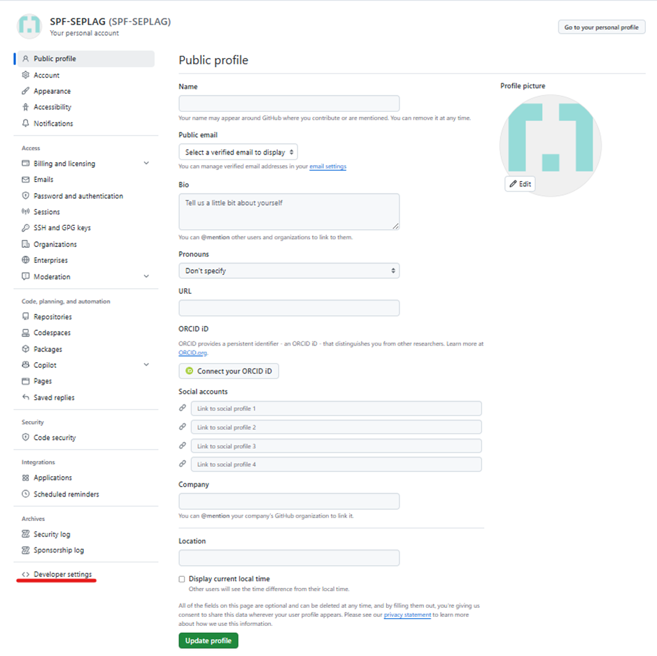
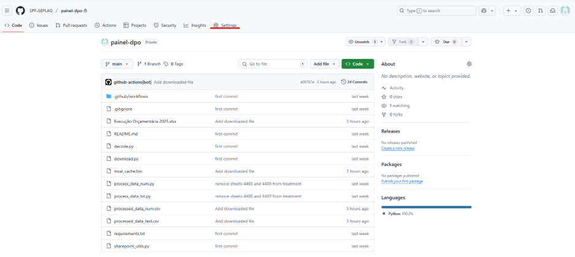
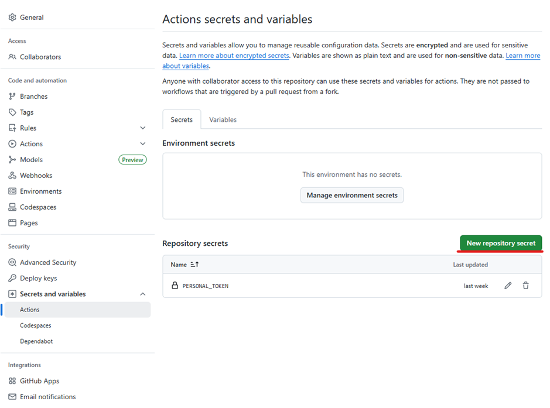
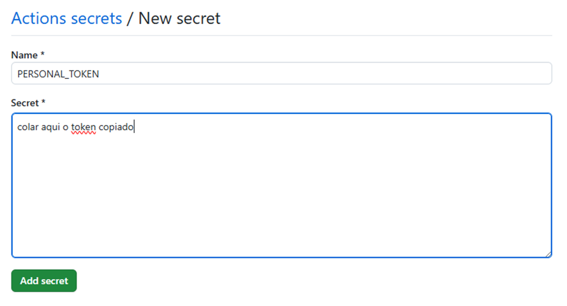

# Setup Secrets, PAT e Actions Github 
É necessário criar o Secret e o Personal Access Token (PAT) no Github para correta execução dos Actions do Github quando o repositório for privado. 

## Criar PAT

> Conta > Settings > Developer settings > Personal access tokens > Tokens (classic) > Generate new token > Generate new token (classic) > Note: gh-action-push > Select scopes: repo (marcar checkbox) > Generate token > Copiar o hash do token 

**Sugestão: copiar e salvar para um txt, pois você não conseguirá ver ele novamente**. 

## Criar Secret
> Repositório > Settings > Secrets and variables > Actions > New repository secret > Name: PERSONAL_TOKEN, Secret: colar a hash do PAT que você copiou > Add secret 

