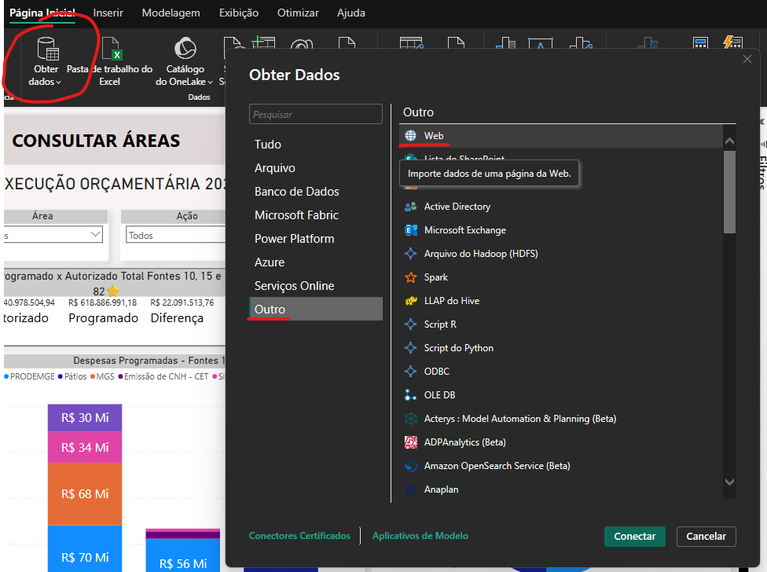
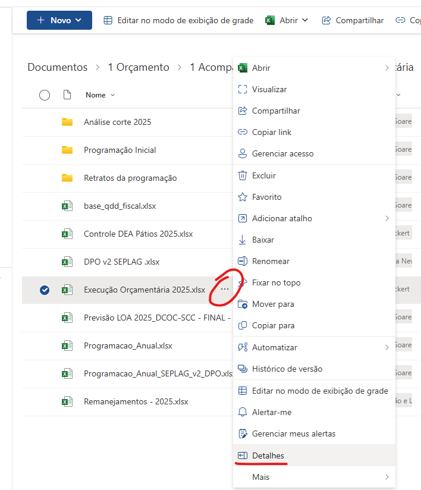
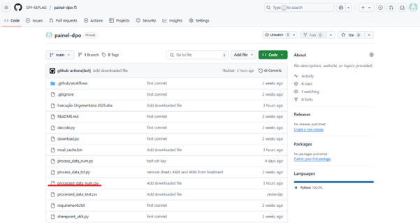
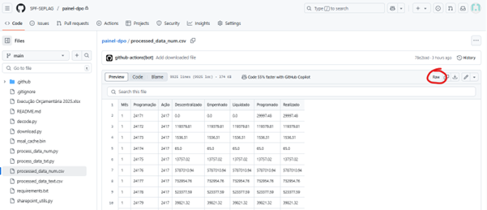
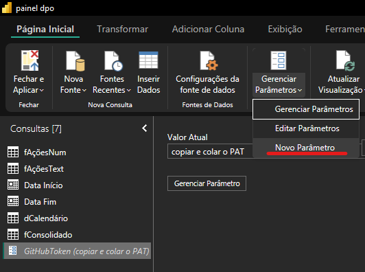
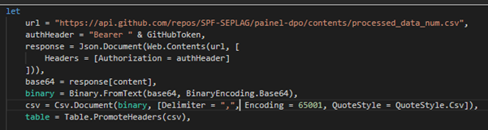

## Carregamento de dados de Planilha do Sharepoint no Power BI 
- Obter dados no Power BI 


- Extrair links da planilha no Sharepoint



- Colar link no Power BI


## Carregamento de dados do Github no Power BI
- Extrair links das bases




- Criar parâmetro no PBI e copiar e colar a hash do Personal Access Token (PAT) do Github, criado em momento prévio


- Criar consulta nula que irá armazenar os dados


- Carregar dados via **Power Query M**, copiando e colando o código abaixo no PBI, alterando a URL



> O código citado serve para consumir os dados via API do próprio github, sendo passado no cabeçalho da requisição o tipo Bearer e o PAT.

```powerquery
url = "https://api.github.com/repos/SPF-SEPLAG/painel-dpo/contents/processed_data_num.csv",
authHeader = "Bearer " & GitHubToken,
response = Json.Document(Web.Contents(url, [
    Headers = [Authorization = authHeader]
])),
base64 = response[content],
binary = Binary.FromText(base64, BinaryEncoding.Base64),
csv = Csv.Document(binary, [Delimiter = ",", Encoding = 65001, QuoteStyle = QuoteStyle.Csv]),
table = Table.PromoteHeaders(csv),
```

