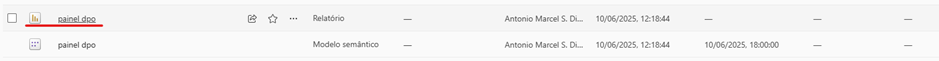
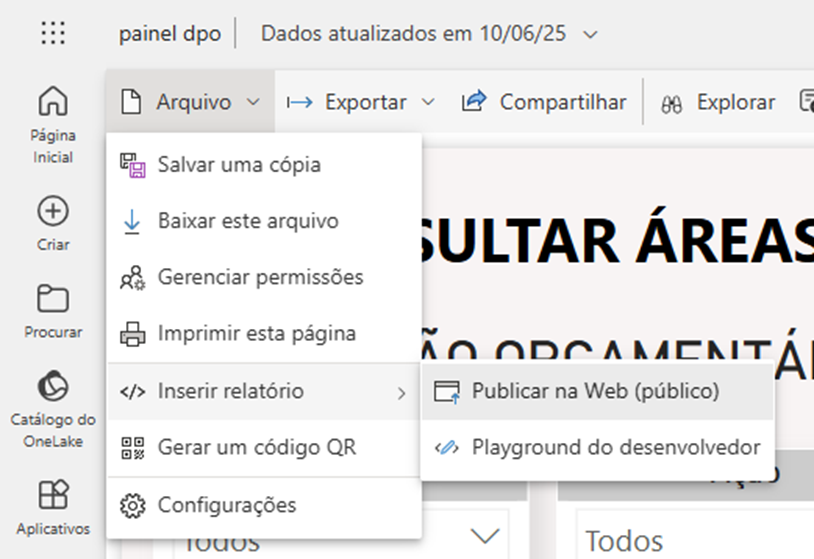
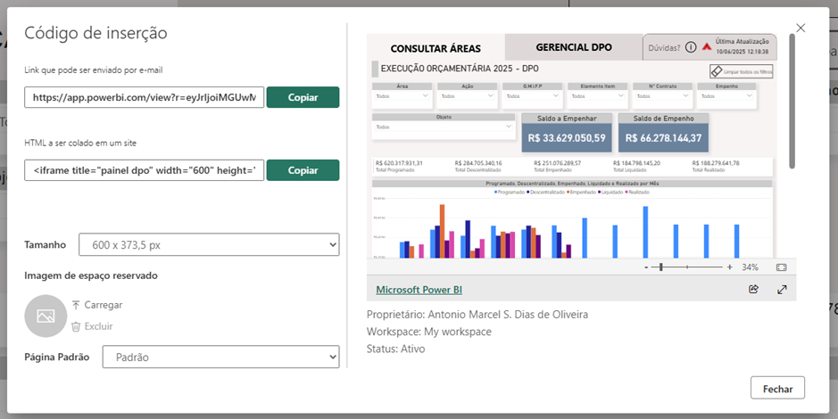
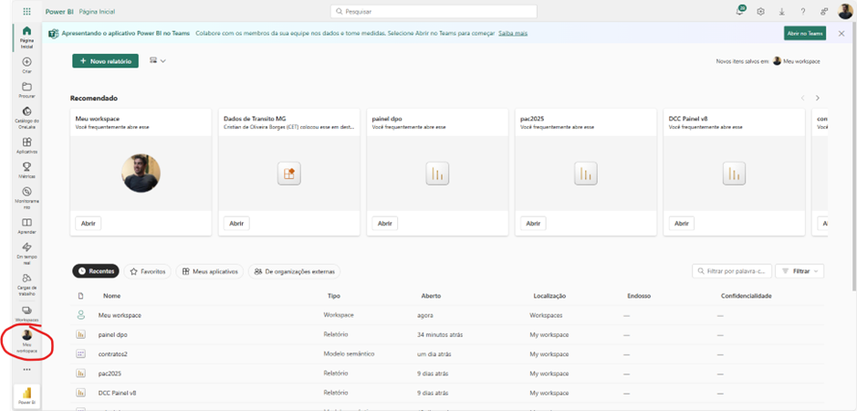
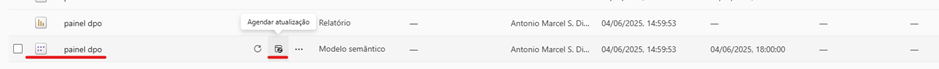
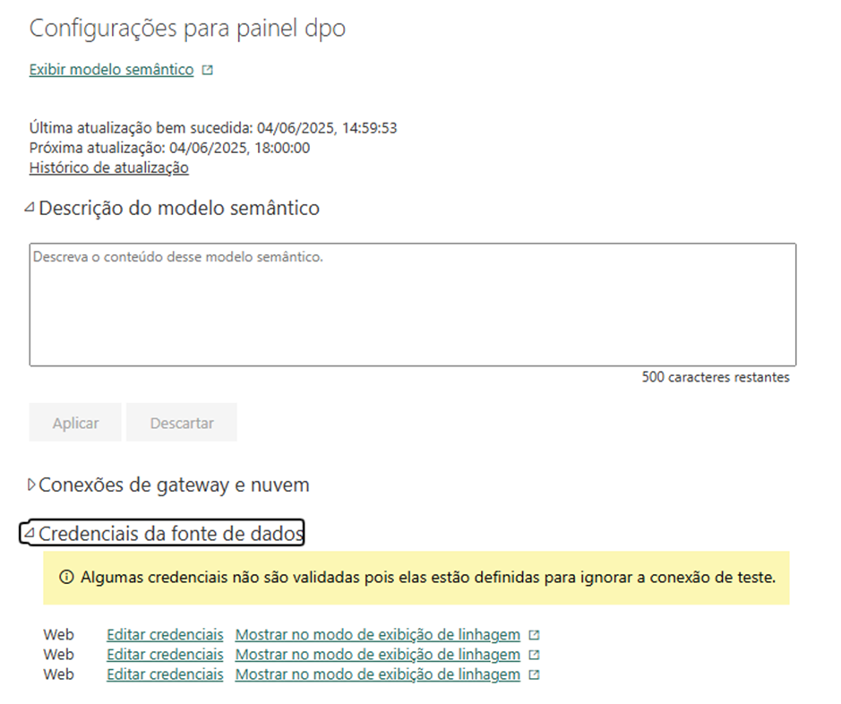
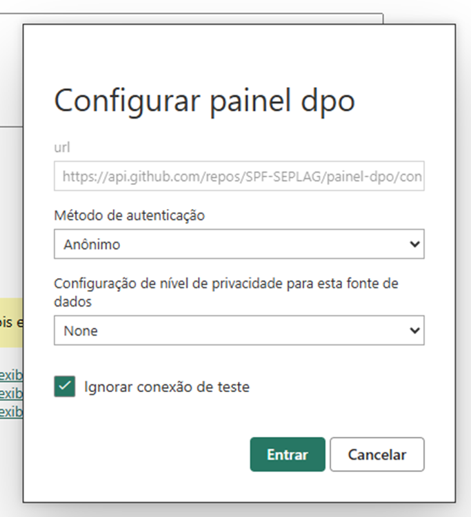
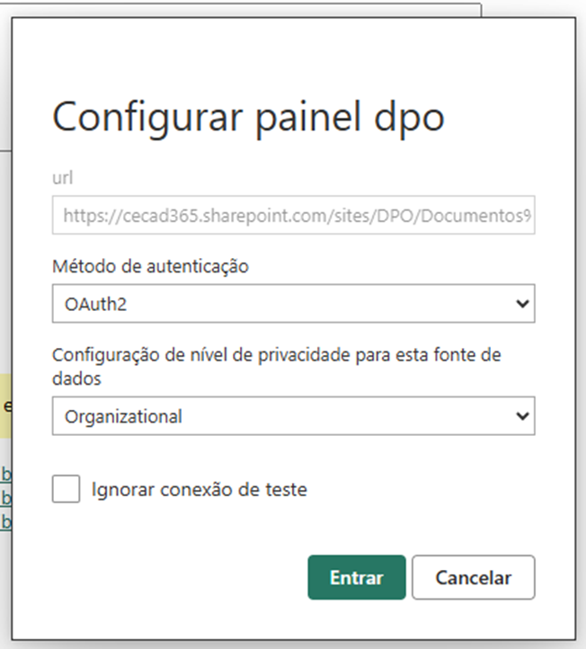
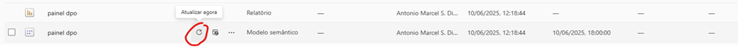

- Uma vez elaborado o relatório, será necessário realizar a publicação dos dados

## Gerar o link do dashboard
- Acesse o relatório do painel no PBI Web

## Acessar o modelo semântico

## Configurar credenciais bases Github
- Definir as credenciais de acesso para as bases do github

    
## Configurar credenciais bases Excel Sharepoint

## Definir periodicidade de atualização dos painéis
- É possível definir a frequência de atualização e inserir contato de e-mail que será notificado em caso de erro de atualização 

> Também é possível realizar a atualização manualmente caso necessário 

